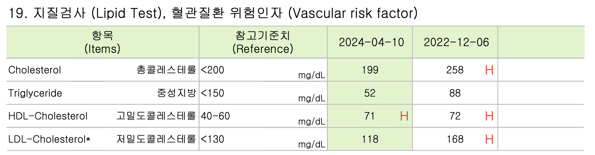

2024년 올해 들어 연속 혈당 측정기를 10번 넘게 사용했다. 

2년 전 건강검진에서 공복혈당 120이라는 결과를 받아본적은 있으나, 재검 결과 공복혈당은 88 당화혈색소는 5.6%로 정상이었다. 의사선생님은  전날 잠을 잘 못잤거나 금식 전 무얼 먹었는지에 따라 당일 공복혈당은 크게 영향을 받을 수 있기 때문에, 한 번의 결과로 당뇨를 진단하지 않으며 수치도 정상의 범주이니 괜찮다고 하셨다.

그 이후 당뇨 가족력도 있는 마당에 '계속 이렇게 살아도 괜찮을까,,' 내심 걱정만 하는 상태로 똑같은 일상을 살아가고 있었다. 그러다 올해 들어 우연한 기회로 연속 혈당 측정기를 처음 사용해보게 되었다.

결과는 꽤나 충격적이었다. 유튜브에서 '혈당에 좋은 음식'을 검색하여 나온 결과인 통곡물밥과 시금치 된장국에 멸치볶음, 오이무침 등을 곁들여 먹고는 뿌듯했다. 얼마나 혈당 그래프가 안정적으로 유지될까 기대하며 확인했을때, 그래프는 식후 100이 넘게 상승하여 최고 혈당 223을 찍었다. 당뇨가 없는 건강한 사람은 어떤 때에도 140을 넘지 않는 것이 가이드라인 이라는데 멀어도 한참 멀었다.

혈당 수치는 대체로 밥, 빵, 면을 완전히 배제한 식사를 하면 식후 2시간 이내 최대치 130-150선, 밥 반 공기 정도를 곁들이면 180선, 밥이나 면 1인분을 모두 먹으면 200 이상이었다.

선뜻 이해가 안됐다. 일주일에 2-3번은 운동을 하고 있었고, 일주일에 2-3번은 샐러드를 끼니로 하며, 늘 정상 체중을 유지하고 있었다. 직장인이 할 수 있는 선에서, 건강을 위한 어느 정도의 실천은 하고 있다고 생각했는데, 이 정도일 일인가 싶어 좀 억울하기 까지 했다. 하지만 뭐 어쩌겠는가, 치솟는 그래프를 보면 뭐라도 하지 않을 수 없었다. 이후 혈당 관리에 유용한 방법을 찾아, 식후 운동을 하고, 거꾸로 식사법을 실천하고, 밥/빵/면을 최대한 줄이려고 노력했다.

그렇게 연초부터 3개월 가량 꾸준히 실천하고, 올해 4월 건강검진을 하게되었다. 2년 전과 비교하여 혈압, 혈당, 체성분, 동맥경화진단 등 대사와 관련된 모든 부분이 놀랍도록 개선되어 있었고, 소변검사에서는 지방을 에너지원으로 사용할 때 발생하는 대사 산물이라는 케톤체까지 검출되었다.

|혈당|
|:---|
|{: .w-100 class="left"}{: .w-100 class="left"}|

|혈압|
|:---|
|{: .w-100 class="left"}|

|동맥경화|
|:---|
|{: .w-100 class="left"}|

|케톤 검사|
|:---|
|{: .w-100 class="left"}|

|체성분|
|:---|
|{: .w-100 class="left"}|

이렇게 혈당관리를 통한 생활습관의 변화가 전반적 건강 개선으로 이어지는 것을 확인하고 나니, 그간의 식사기록과 신체 활동, 수면 등에 따른 혈당 추이를 분석하고 현실적인 개선점을 찾는 과정을 공유하여 긍정적 경험을 나누고 싶었다.

이에 앞으로 연속 혈당 측정기에서 기록한 혈당 데이터와 애플 워치에서 기록한 건강데이터를 이용하여, 데이터 프로세싱, 분석, 시각화 등의 분석과정을 거쳐, 현실적이고 실천가능한 혈당 관리 방향을 도출하는 과정을 기록해보고자 한다. 

혈당 관리를 하며 얻은 가장 큰 성과는 나의 무신경함과 충동으로 내 몸이 고생하고 있었다는 사실을 깨닫고, 이를 바로 잡을 수 있는 방법을 배우게 되었다는 것이다.

우리 몸은 소우주라 불릴만큼 신비롭고 복잡하다. 매일 수 많은 일이 일어나고 있겠지만, 무슨일이 일어나고 있는지는 모른다. 그렇기에 내가 할 수 있는 일을 하는 수 밖에 없고, 그것은 매일의 작은 선택을 가능한 몸에 이로운 방향으로 하는 것이리라 생각한다.

건강한 식사를 선택하고, 정돈된 생활습관을 선택하는 것. 그 작은 선택이 시간과 함께 켜켜이 쌓이다 보면, 강건한 신체와 정신의 나를 발견할 수 있으리라 믿는다.